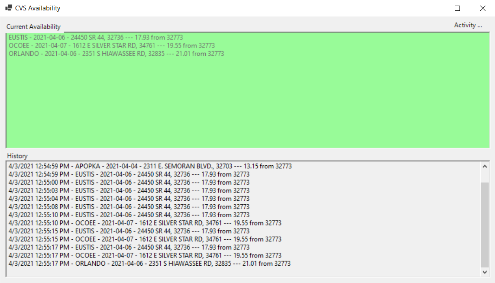

# CVSCovidLocator
Used to identify when CVS has COVID Vaccine available near me

For the sake of clarity this will *NOT* reserve you a spot or anything like that. This will just inform you when a spot is available, you'll still need to go through the full process. I'd suggest that you complete everything up to the "Schedule Dose" page, then leverage this tool to know when you can search / select.

You'll also need to fill out the API key for yourself. It shouldn't be hard to find if you watch the network calls from your browser's dev tools...

API Key and ZIP codes to search can be set in the config.json file.

Yes this is bad code, and there are ways to optimize it. I just built something to be quick and dirty to serve a purpose.

